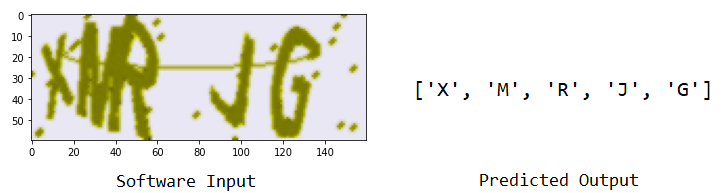
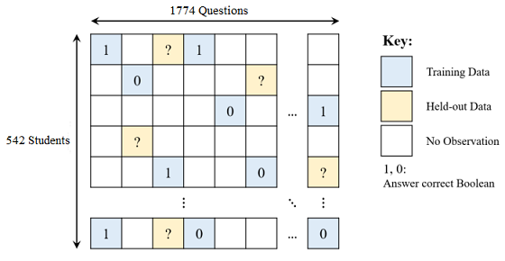
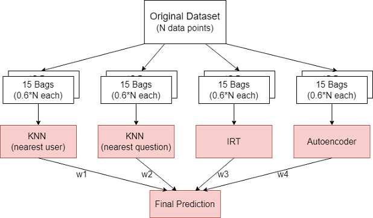
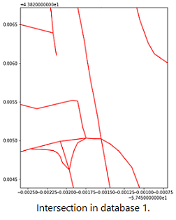
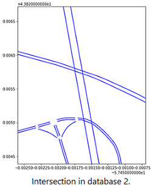
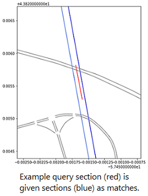
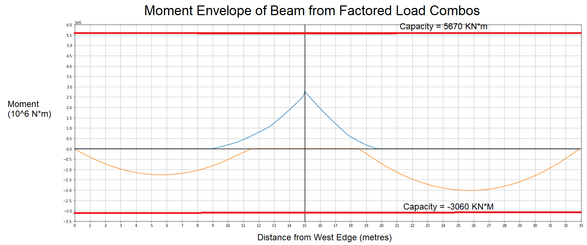

&nbsp;
# Project 1: Alphanumeric CAPTCHA Solver
[Article Link](https://github.com/Ceudan/Alphanumeric-CAPTCHA-Solver)

Led a team of 4 to independently design from scratch a multi-staged software that decodes alphanumeric CAPTCHA images. Motivation was a course final project. Input consists of 5 character CAPTCHAs disguised with noise and various levels of overlap, rotational, distance and colour distortions. Output is a 5 character prediction of the sequence.

 

Stages:
\
&#8291;1. Preprocessing using computer vision libraries to eliminate noise.
\
&#8291;2. Character segmentation using object recognition to localize individual characters.
\
&#8291;3. Character classification using a convolutional neural network followed by several fully connected layers.

Achieved mark of 90%. Achieved an accuracy of 71% per entire CAPTCHA image and 91% per individual character. These accuracies are high given that CAPTCHAs are designed not to be bypassed by computer software. 
\
\
Skills Learned: computer vision libraries, image processing, deep-learning, generating custom train data

# Project 2: Predicting Student Question Performance
[Article Link](https://github.com/Ceudan/Predicting-Student-Question-Performance)

Led a team of 3 to write an ensemble machine learning model with bagging to predict a student's performance on diagnostic questions. Our ensemble combined 3 distinct algorithms. Motivation was a course project.

Given Data

Model Architecture

Achieved mark of 97%. We ranked 18th in a coursewide competition (over 300 eligible competitors) with an accuracy of 70.3%. After updating model to current version, accuracy increased to 71.3%, which would have ranked us 5th place.
\
\
Skills Learned: pytorch, autograd, optimization, bagging, ensemble

# Project 3: Matching Road Sections between Databases
[Article Link](https://github.com/Ceudan/Match-Roads-Between-Databases)

I independently created software to match sections across databases using geospatial information. It was designed to allow my supervisor to quickly match traffic information from third party sources to his Aimsun traffic model. This was one of the many tasks I recieved at the University of Toronto Transportation Research Institute. Hurdles included:
- over 100,000 road sections per database (strong time complexity requirements)
- close proximity does not gaurentee correct match
- geographic coordinates carry up to 10 metres of uncertainty

   

Achieved an accuracy of 94% on normal road types. Accuracy is dynamic since adjustable thresholds can tradeoff quantity with quality. It was succesfully used to match sections from an Aimsun traffic simulation covering the GTHA, with HERE Technologies' observed traffic information.
\
\
Skills Learned: GeoPandas, GIS, shapefiles, search algorithms, matrix/array time dependancies

# Project 4: Calculating Internal Forces of Reinforced Concrete Bridge

I independantly coded from scratch a Python program to calculate reactions, shear and moments across all parts of a doubly spanned reinforced concrete bridge. The motivation was a course project where we had to design all components of the bridge, meeting servicability and ultimate safety limit states.  The program provided instantanous results/feedback, and prevented the meticulous hand backcalculations when concrete members had to be adjusted. Programming hurdles included the calculations of integrations of various shapes and the organization of long complex structural procedures into readable and organized code functions.

The program had the following stepwise structure. 
1. Classes for all common shapes in moment diagrams were created. This included functions for quick multiplication between shapes and visualizations.
2. Classes and corresponding objects for reactions. This included objects for live loads, dead loads, and abutment reactions. Primary information stored were moment and shear diagrams for each member.
3. The final state of the bridge was resolved. This meant simulating superposition and the force method, to figure out which values of abutment reactions corresponded to a state of equilibrium when bridge was in given state. 

Example of calculated moment envelope for bridge's beam.

The program was succesfully used not only to instantaneously calculate all desired values, but also visualize them graphically for quick interpretation. 
